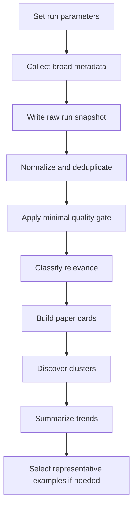

# Paper Scout Guide

Last updated: 2026-06-26

## Purpose

This guide defines a reusable workflow for collecting recent LLM reasoning papers for trend analysis.

The goal is to collect nearly all recent papers that appear to be about LLM reasoning and pass a minimal quality bar. This is for trend analysis, not for selecting only the best papers to read.

High recall matters more than strict ranking. A weak but relevant paper can still be useful evidence of a trend.

## Operating Principle

Use a staged pipeline:

1. Collect broad metadata.
2. Remove duplicates and obvious noise.
3. Apply only a minimal quality gate.
4. Classify relevance from title and abstract.
5. Build compact paper cards.
6. Discover clusters from the collected papers.
7. Summarize trend patterns across the corpus.
8. Optionally identify representative examples, without treating them as the only valuable papers.

Do not ask one model to deeply read hundreds of papers. Use cheap models for scout work and stronger judgment only where it matters.

Do not predefine subfields during collection. If a paper appears to be about LLM reasoning, collect it first and decide its importance later. When unsure, keep the paper as `adjacent` instead of discarding it.

## Workflow Diagram

Collection and analysis stay separate:

- The raw run snapshot preserves what was collected.
- The normalized corpus is what analysis operates on.
- Representative examples are chosen after clustering, not during collection.

The raw snapshot format is defined in `tracker-rules/run-file-format-rules.md`.

## Collection Target

For each run, collect papers from the recent date window that satisfy all of these:

- The paper has a title, abstract or summary, authors, date, and stable source link.
- The paper appears to be about LLM reasoning from the title, abstract, or venue metadata.
- The record is not an obvious duplicate, placeholder, spam entry, or inaccessible metadata stub.
- The paper is recent enough for the run window.

Do not require strong experiments, strong baselines, a famous lab, code release, citation count, or venue acceptance for inclusion. Those are analysis fields, not collection filters.

## Source Policy

Prefer official APIs or official bulk data paths.

### arXiv

Use:
- arXiv API for real-time metadata search
- OAI-PMH for bulk metadata or keeping a local metadata mirror
- RSS only for lightweight daily discovery
- official bulk/full-text paths when full text is genuinely needed

Rules:
- Legacy arXiv APIs, including OAI-PMH, RSS, and the arXiv API, should be limited to no more than one request every three seconds with a single connection.
- Store and transform descriptive metadata freely.
- Link users to arXiv abstract pages for paper access.
- Do not store and serve arXiv PDFs or source files unless the license permits it.
- Do not try to bypass rate limits or download the whole corpus programmatically.

References:
- https://info.arxiv.org/help/api/tou.html
- https://info.arxiv.org/help/bulk_data.html

### Semantic Scholar

Use:
- Academic Graph API for paper metadata, authors, citations, venues, abstracts, and embeddings when useful
- API keys when available
- dataset downloads only when the scale justifies them

Rules:
- Expect throttling.
- The introductory API-key rate limit is 1 request per second.
- Unauthenticated public endpoints may share a much larger pool, but should not be treated as guaranteed capacity.
- Do not fabricate citation counts, venue data, or code links when the API does not provide them.

Reference:
- https://www.semanticscholar.org/product/api

### OpenReview

Use:
- OpenReview API 2 by default
- API 1 only for older venues that still require it
- public submissions, decisions, and venue metadata when available

Rules:
- Treat reviews, comments, and anonymous metadata carefully even when public.
- Do not access private endpoints.
- Verify venue and acceptance claims before using them as quality signals.

Reference:
- https://docs.openreview.net/getting-started/using-the-api

## Do Not Do

- Do not scrape HTML pages when a stable API is available.
- Do not run aggressive parallel crawlers.
- Do not download hundreds of PDFs by default.
- Do not commit large raw dumps unless the repository explicitly adds a data policy.
- Do not redistribute paper full text.
- Do not trust keyword matches blindly.
- Do not filter through a predefined subfield whitelist.
- Do not filter for only strong, famous, accepted, or personally interesting papers.
- Do not let a small model make final research judgments alone.
- Do not claim complete coverage.

## Expected Scale

For a 30-day LLM reasoning run:

- Broad crawl target: 500-800 candidate records
- Likely relevant after filtering: 100-200 records
- Trend-analysis corpus target: all central and plausible adjacent records that pass the minimal quality gate
- Optional representative examples for reporting: selected after clustering, not during collection

These are planning estimates, not success metrics.

## Run Specification

Before each scout run, define:

- Topic: reasoning
- Date window
- Sources
- Query set: broad LLM reasoning queries, not a predefined subfield seed list
- Maximum records per source
- Rate limits
- Whether PDF download is allowed
- Output file targets
- Model assignment

Default policy:
- Metadata and abstracts are allowed.
- PDFs are skipped by default because the trend corpus should be built from metadata and abstracts.
- Any venue, citation, benchmark, code, or acceptance signal must be linked to a source.

## Relevance Labels

Use three top-level labels.

### `central`

The paper is centrally about LLM reasoning.

Use this label when the paper's main question, method, evaluation, or claim is about how language models reason, improve reasoning, evaluate reasoning, or fail at reasoning.

Do not require the paper to match a predefined subtopic. If it looks like LLM reasoning from the title and abstract, collect it.

### `adjacent`

The paper helps interpret the target topic but is not mainly about it.

Use this label when the paper is about language models and may affect reasoning work, but reasoning is not the central object of study.

### `noise`

The paper contains matching keywords but is not useful for the target trend analysis.

Common noise:
- papers that use "reasoning" only as a generic word
- papers where the reasoning object is not an LLM, VLM, or language-model-centered agent
- papers with little connection to modern language models
- papers whose title or abstract gives no clear reason to treat them as LLM reasoning work

## Paper Card Fields

Each central or adjacent paper should get a compact card.

Required fields:
- Title
- Link
- Date
- Source
- Relevance: central | adjacent | noise
- Why this is LLM reasoning
- One-sentence summary
- Key claim
- Method type
- Benchmark or task domain
- Evidence quality: strong | medium | weak | unclear
- Baseline quality: strong | medium | weak | unclear
- Code or data availability
- Venue or review signal
- Trend signal
- Inclusion note
- Exclusion note, only if excluded as noise

Keep cards short. A paper card is a trend-analysis artifact, not a full review and not a reading recommendation.

## Clustering Rules

Do not start from a fixed list of clusters.

Cluster only after collecting and filtering papers. The cluster structure should come from the papers themselves, not from a predefined taxonomy.

Cluster by actual research question, failure mode, evaluation target, or methodological pattern. Avoid forcing a paper into a familiar bucket just because its keywords match.

For each cluster, record:
- What problem the cluster is trying to solve
- How many papers fall into the cluster
- Common claims or framing
- Common evaluation patterns
- What looks new
- What looks recycled or hype-driven
- Representative examples
- Outliers or unusual papers
- Open questions

## Model Assignment

Small models are acceptable for:
- metadata cleanup
- deduplication
- title and abstract filtering
- open-ended descriptive tagging
- rough relevance labels
- short paper cards
- initial cluster suggestions

Mid-size models are useful for:
- merging duplicate clusters
- removing subtle noise
- improving paper-card consistency
- checking whether descriptive tags are supported by the abstract

Strong models or human review are required for:
- final cluster naming
- distinguishing real trends from keyword overlap
- judging experimental quality
- checking baseline adequacy
- identifying inflated claims
- writing the final trend report
- choosing representative examples for the report

## Trend Report Requirements

A monthly or weekly report should include:

- Date window
- Query set
- Sources used
- Total records collected
- Number of central papers
- Number of adjacent papers
- Number of noise papers
- Main clusters
- Cluster sizes
- Cluster-level summaries
- Representative examples per cluster
- Repeated claims and common framing
- Common benchmark and evaluation patterns
- Weak or hype-heavy patterns
- Emerging directions
- Open questions for the next run

The report must say when coverage is incomplete.

## Quality Checks

Before trusting a scout run, check:

- Are duplicates merged by arXiv ID, DOI, title normalization, and Semantic Scholar paper ID where possible?
- Are withdrawn or superseded records marked?
- Are date filters based on submission/update dates consistently?
- Are venue and acceptance claims verified?
- Are code links real and not just project-page placeholders?
- Did the crawler respect current source rate limits?
- Did the run avoid mass PDF download?
- Did the minimal quality gate avoid excluding weak but trend-relevant papers?
- Did the final report distinguish corpus coverage from paper quality?

## Repository Mapping

Use generated run outputs for the full trend-analysis corpus.

- Full crawl output should go under `runs/reasoning/raw/raw-records.jsonl`.
- Curated active candidates may go to `topics/reasoning/reading-queue.md` only when the user wants a reading queue.
- Completed, skimmed, skipped, or archived reading entries go to `topics/reasoning/paper-log.md`.
- Reasoning-specific exceptions go to `topics/reasoning/tracker-rules.md`.

Do not mix raw crawl output into curated queue or log files.

## Default Decision Rule

When uncertain:

- Keep high-recall metadata during the crawl.
- Keep weak but relevant papers in the trend corpus.
- Use quality judgments as annotations, not as collection filters.
- Prefer "unclear" over invented certainty.
- Link to evidence instead of relying on model memory.
